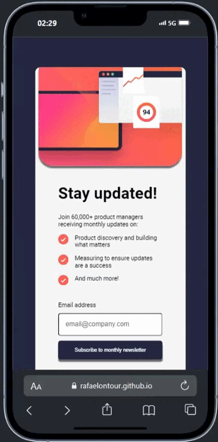
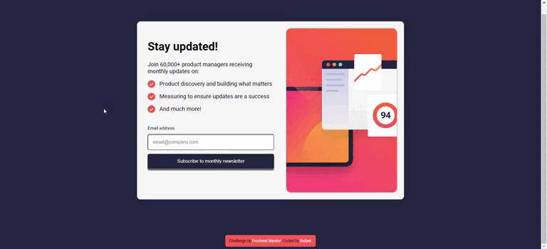

# Frontend Mentor - Newsletter sign-up form with success message

[Minha solução para este desafio](https://rafaelontour.github.io/landing-page)

## Built with
- Semantic HTML5 markup
- Responsividade usando a função clamp() e a propriedade width.

Responsive pages

##

# Dispositivo móvel

# Computador 

# Alterando tamanho

